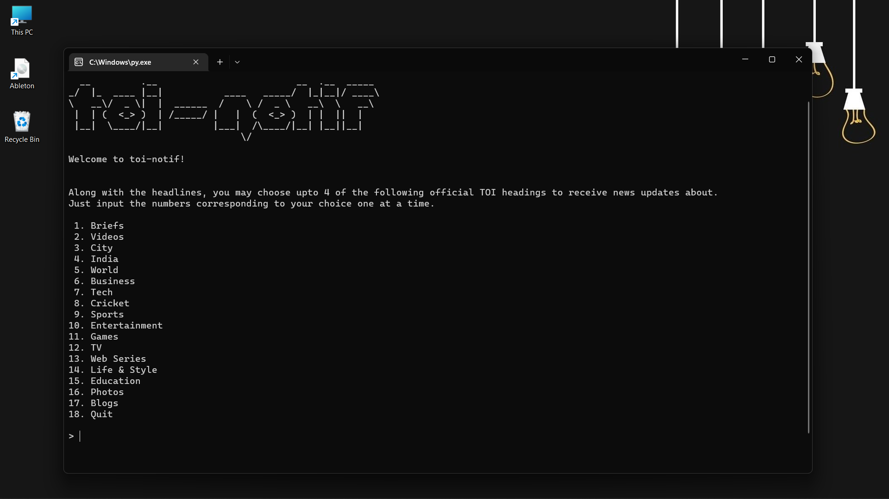
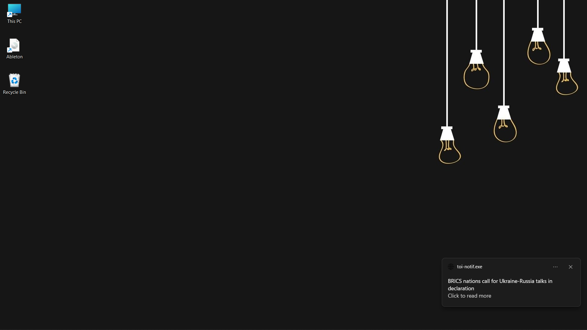
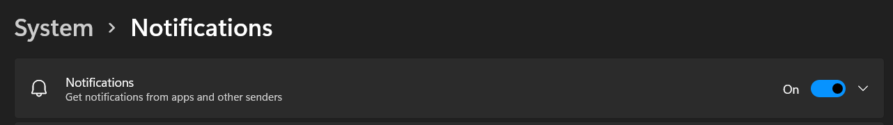

# toi-notif

Desktop notifications of news headlines from the Times of India.

## Why?

Even though lots of news providers exist, people are often particular about the ones they receive their news from and Times of India, being one of India's biggest newspapers, is preferred by a large population due to its reliability. However, it is a tedious task to always go to their website to read news, and thus, toi-notif provides these news updates directly as desktop notifications without interrupting any work.

## Installation

- Download the installer [here](https://github.com/mihiraggarwal/toi-notif/releases/download/v1.0.0/toi-notif-final.exe) on your Windows device.
- Press `Win+R` and run `shell:startup`.
- Drag and drop all files onto this folder.

## Configuration and Usage

- The first time the laptop is booted after installation, a configuration window will pop up. This can also be done manually by launching `toi-notif.exe`.
- Up to 4 sections can be chosen from each of which, notifications about the top 5 news articles will be displayed. The general headlines for the day will also be displayed.
- The news will be displayed every time the laptop is booted after configuration. These will be displayed in the interval of time chosen by the user.
- Clicking on the notification will open the official TOI article in the browser.
- Optionally, though not recommended, `toi-notif.exe` can also be manually launched whenever news updates are to be received.
- To reconfigure, simply launch `config.exe` located inside the `scrape` folder.

## Demo video

https://user-images.githubusercontent.com/49950982/175776895-dc1ed038-cf39-4c51-982a-f7558191401d.mp4

## Troubleshooting

- The device must be connected to the internet.
- Make sure external notifications are enabled in `Settings > System > Notifications`.
  
  

P.S - toi-notif is not affiliated with Times of India
